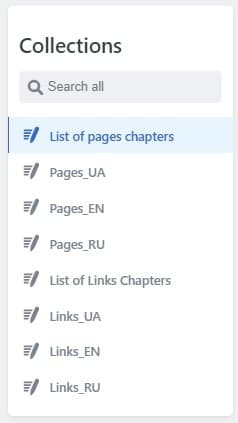

# Инструкция к админ-панели

## Доступ в админ-панель

Панель администратора сайта открывается при переходе по
[ссылке](https://profound-lokum-cdd3e6.netlify.app/admin/).

Доступ к админ-панели можно получить только по приглашению на электронную почту.
Необходимо открыть письмо и перейти по ссылке с названием `Accept the invite`.

Пользователя переадресует на сайт, где ему нужно перейти в админ-панель, добавив
в адресную строку браузера `/admin`.

Откроется окно с просьбой завершить регистрацию. Для этого в поле нужно ввести
пароль, который пользователь будет использовать для входа в админ-панель.

После клика на кнопку `Sign up` пользователю будет предоставлен доступ к
админ-панели.

Якщо є необхідність змінити пароль або відновити його у випадку втрати,
користувач при вході може натиснути на відповідну кнопку `Forgot password?`

Далі потрібно ввести пошту, на яку користувач отримував запрошення і натиснути
`Send recovery email`

Адміністратор отримає лист на введену пошту із проханням підтвердити зміну
пароля. Для цього потрібно перейти за посиланням у листі `Reset password`:

Далі потрібно лише ввести новий пароль у вікні, що відкриється та зберегти
зміни:

---

## Структура админ-панели

Админ-панель имеет структуру, показанную на рисунке:

- **List of pages chapters** – это список разделов документации. В коллекции
  только одна запись, которую нельзя удалить, добавить еще записи также
  невозможно. Чтобы редактировать данные о разделах сайта, необходимо вносить
  изменения в существующую запись.

  Чтобы внести изменения, необходимо отредактировать список уже созданных
  разделов. Поле **_PAGES CHAPTER NAME_** используются в качестве части
  URL-адресса страницы данного раздела (`home`, `component` и др.). Также
  необходимо указать названия данного раздела на раных языках (украинский,
  английский и русский). Можно указать также **_PAGE CHAPTER RANGE_** - цифра,
  которая обозначает очередность размещения раздела на сайте (сверху вниз).

  Этот список нужно редактировать только в случаях, когда необходимо создать
  НОВЫЙ раздел.

Далее следуют коллекции страниц, упорядоченные по языку контента:

- **PAGES_UA**
- **PAGES_EN**
- **PAGES_RU**

- **List of links chapters** – это список разделов документации, которые не
  содержат в себе текстовых страниц, а только ссылки на внешние источники
  (`presentations`, `templates` и др.). В коллекции только одна запись, которую
  нельзя удалить, добавить еще записи также невозможно. Чтобы редактировать
  данные о таких разделах сайта, необходимо вносить изменения в существующую
  запись.

  Чтобы внести изменения, необходимо отредактировать список уже созданных
  разделов. Названия элементов списка используются в качестве названий папок для
  сохранения разделов. Также необходимо указать названия данного раздела на
  раных языках (украинский, английский и русский). Можно указать также **_LINKS
  CHAPTER RANGE_** - цифра, которая обозначает очередность размещения раздела на
  сайте (сверху вниз).

  Этот список нужно редактировать только в случаях, когда необходимо создать
  НОВЫЙ раздел для ссылок на внешние источники.

Далее идут коллекции разделов для внешних страниц, упорядоченные по языку
контента:

- **Links_UA**
- **Links_EN**
- **Links_RU**

---

## Добавление новых страниц и разделов

Чтобы добавить новую страницу в существующий раздел, необходимо зайти в
коллекцию **PAGES_UA**, **PAGES_EN**, **PAGES_RU** и добавить следующую
информацию:

- В поле `TITLE OF THE PAGE` название страницы на соответсвующем языке, которое
  будет отображаться на сайте;

- В поле `PAGE CHAPTER SLUG` выбрать часть URL-адреса страницы в соответствии с
  разделом, к которому относится создаваемая страница
  (yoursite.com/`PAGE CHAPTER SLUG`/);

- В поле `PAGE CHAPTER TITLE` выбрать название раздела, к которому относится
  создаваемая страница;

- В поле `SLUG` ввести еще одну часть URL-адреса страницы. Должна быть понятной,
  описательной, на английском языке, с маленькой буквы, без "/"
  (yoursite.com/`PAGE CHAPTER SLUG`/`SLUG`). Это поле должно быть одинаковым для
  одной и той же страницы вне зависимости от ее языка;

- В поле `IDENTIFIER` нужно ввести слово-описание данной страницы, должно быть
  понятным, на английском языке, с маленькой буквы, без "/". Это поле должно
  быть одинаковым для одной и той же страницы вне зависимости от ее языка. Может
  совпадать с полем `SLUG`;

- В поле `BODY` необходимо внести непосредственно контент страницы. Чтобы
  добавить картинку в текст, нужно нажать кнопку `+` и выбрать `Image`, как
  показано на рисунке:

Здесь необходимо выбрать нужную картинку, а в поле `ALT TEXT` вписать описание
данной картинки на языке контента страницы.

- В поле `NOTE` опционально можно внести информацию, подбивающую итоги страницы,
  чтобы на странице она была вынесена отдельно;

- В поле `PAGE RANGE` опционально можно указать цифру, которая обозначает
  очередность размещения страницы в разделе на сайте (сверху вниз).

Далее нажать кнопку `Publish` вверху записи, также запись можно удалить, нажав
кнопку `Delete entry`.

Для добавление новых ссылок на внешний контент в существующем разделе необходимо
зайти в языковые коллекции **Links_UA**, **Links_EN**, **Links_RU**:

- В поле `FILE TITLE` необходимо ввести название записи;

- В поле `LINK CHAPTER SLUG` выбрать адрес раздела, к которому относится
  создаваемая страница;

- В поле `LINK CHAPTER TITLE` выбрать название раздела, к которому относится
  создаваемая страница;

- В поле `TITLE OF THE LINK` необходимо ввести название ссылки, которое будет
  отображаться на странице;

- В поле `URL ADRESS` необходимо ввести адрес на внешний источник;

- В поле `LINKS RANGE` опционально можно указать цифру, которая обозначает
  очередность размещения ссылки в разделе на сайте (сверху вниз).

Администратор чаще всего будет добавлять новые записи в языковые коллекции
**PAGES_UA**, **PAGES_EN**, **PAGES_RU** и **Links_UA**, **Links_EN**,
**Links_RU**.

Если нужно добавить новый раздел, администратору необходимо зайти в коллекции
**List of pages chapters** или **List of links chapters**, добавить информацию о
разделе в существующих записях и только потом создавать страницы к данному
разделу в языковых коллециях.

При изменении информации о разделе, необходимо также зайти в языковые коллекции
в записи соответствующих страниц (относящихся к данному разделу), и
скорректировать информацию в полях этих страниц, касающуюся разделов.
